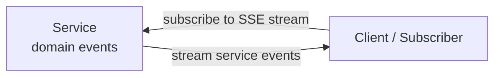
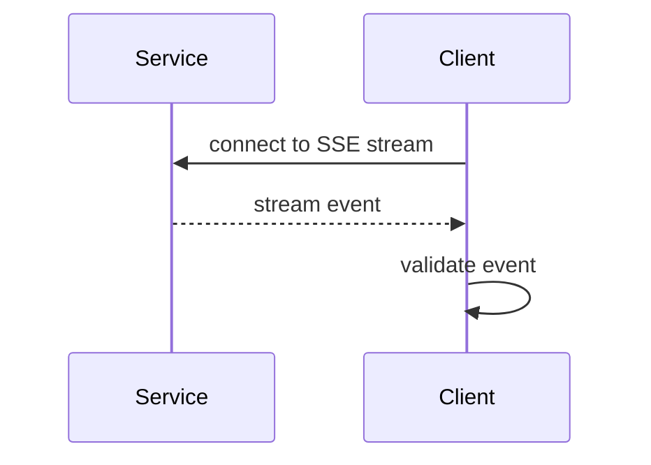

# Event Emission Protocol 0.1.0

Event Emission Protocol is a one-way protocol for emitting service-side events to a client.

In version 0.1.0, the only transport defined by this specification is SSE Pull: a service exposes an SSE endpoint, and a client connects as a subscriber.

## Goals

- Separate protocol message structure from transport.
- Let clients subscribe to a service event stream and receive events.
- Keep the core protocol message type limited to `event`.
- Avoid per-event acknowledgements in the core protocol.
- Keep client-internal processing, routing, fanout, approvals, and tool calls outside this protocol.
- Represent protocol compatibility with `protocol_version`.

## Scope

Version 0.1.0 defines:

- Envelope schema
- Protocol-level event type
- Service-defined event name and event schema
- Connection rejection behavior when an SSE endpoint requires authentication
- SSE `id` as an optional stream cursor
- No required resume or replay behavior through `Last-Event-ID`
- SSE keep-alive comments
- Optional keep-alive interval hint from client to service
- No capability negotiation
- Versioning through `protocol_version`

Version 0.1.0 does not define:

- Client-internal execution model
- Client-internal agent selection, fanout, or orchestration
- Client-internal delivery to agents, inboxes, queues, or notifications
- UI behavior
- Full domain event schemas for individual services
- Hosted service operation, billing, or deployment policy

## Actors

- `Service`: a system that produces domain events and exposes them to a client as an SSE stream.
- `Client`: a subscriber that connects to a service SSE stream and receives events.



Event Emission Protocol only covers event emission from a service to a client. Delivery inside the client is out of scope.

If a client needs to report state or errors back to the service, that behavior is defined by another protocol. Audit behavior is an implementation and operations responsibility, not part of this protocol.

## Message Flow



Client-internal delivery, approvals, and processing results are outside this protocol. With SSE Pull, per-event acknowledgement or rejection to the service is not part of the core lifecycle.

## Relationship to MCP

This specification is not an extension to MCP. It does not add MCP transports or MCP message types. It defines an independent one-way protocol for service-to-client event emission.

MCP Streamable HTTP primarily supports agent-to-service tool invocation through JSON-RPC requests. A server can send notifications or requests to a connected client over an open SSE stream, but MCP core does not define service-side discovery, delivery, or wake behavior for disconnected clients.

This specification covers:

- How a service exposes domain events.
- How a client subscribes to a service event stream.
- The one-way event emission path from service to client.

## Envelope

Every protocol message has a common envelope.

`type` is part of the envelope so that a client can classify, select a schema for, validate, and observe a message before deeply interpreting its body.

The message body uses a key that corresponds to the message `type`. Version 0.1.0 only defines the `event` body.

JSON Schema: [`schema/event-emission-0.1.0.schema.json`](schema/event-emission-0.1.0.schema.json)

Example message: [`examples/comment-created.json`](examples/comment-created.json)

| Property | Required | Owner | Role | Notes |
| --- | --- | --- | --- | --- |
| `protocol_version` | yes | Protocol | Identifies the protocol version. | Initial value is `0.1.0`. A client does not process unsupported protocol versions. |
| `message_id` | yes | Service | Uniquely identifies the event message. | Used for audit, dedupe, and debugging. |
| `type` | yes | Protocol | Selects the protocol-level message schema. | In 0.1.0, the basic value is `event.created`. |
| `created_at` | yes | Service | Time when the event message was created. | Used for debugging, observability, and display ordering. |
| `event` | yes | Service | Body for `event.*` messages. | Contains common event fields and service-specific `data`. |

Example:

```json
{
  "protocol_version": "0.1.0",
  "message_id": "msg_...",
  "type": "event.created",
  "created_at": "2026-05-12T12:00:00Z",
  "event": {}
}
```

## Event Body

The message body is stored under the `event` key. Generic body keys such as `body` are not used.

Version 0.1.0 does not define `ack` or `error` messages.

```json
{
  "type": "event.created",
  "event": {}
}
```

The `event` object contains the body of a service-side event. It is not an instruction to an agent. It contains facts, references, priority, and short display text that the client can receive, validate, and pass to its internal implementation if needed.

| Property | Required | Owner | Role | Notes |
| --- | --- | --- | --- | --- |
| `event_name` | yes | Service | Service domain event name. | Examples: `comment.created`, `permission_change.requested`. |
| `data` | optional | Service | Service-specific structured data. | Client core treats it as opaque. |

Common shape:

```json
{
  "event_name": "message.created",
  "data": {}
}
```

Example: comment created

```json
{
  "event_name": "comment.created",
  "data": {
    "document_id": "doc_789",
    "document_title": "Design Draft",
    "comment_id": "cmt_123",
    "comment_text": "Can we revisit the permission model?"
  }
}
```

Example: permission change requested

```json
{
  "event_name": "permission_change.requested",
  "data": {
    "document_id": "doc_789",
    "requested_permission": "public_read",
    "current_permission": "private"
  }
}
```

`event.data` contains only service-specific structured data. It does not contain agent instructions, client-internal `agent_id` values, service-defined execution plans, secrets, or unnecessary full document bodies.

## Message Types and Namespaces

`type` and `event.event_name` are separate namespaces.

- `type`: protocol-level message type defined by this protocol. Version 0.1.0 only defines `event.*`.
- `event.event_name`: domain-level event name defined by each service.

Version 0.1.0 keeps protocol-level `event.*` types intentionally small. The protocol only defines the minimum classification needed for validation and observability. Service-specific meaning belongs in `event.event_name` and `event.data`.

## Protocol-Level Event Types

Version 0.1.0 defines one protocol-level event type.

| Type | Meaning | Notes |
| --- | --- | --- |
| `event.created` | One service domain event occurred. | Domain meaning is represented by `event.event_name`. |

Example:

```json
{
  "type": "event.created",
  "event": {
    "event_name": "document.deleted"
  }
}
```

In this example, the protocol-level meaning is "one service event occurred"; the domain-level meaning is "a document was deleted".

`ack`, `error`, `task`, and `intent` are not defined by Event Emission Protocol 0.1.0.

## Lifecycle

1. Client connects to the service SSE endpoint.
2. Service provides an event stream.
3. Client receives events from the stream.
4. Client validates the event schema.

If an SSE `id` exists, the client may record it as a stream cursor. Event Emission Protocol 0.1.0 does not define replay requests or replay guarantees through `Last-Event-ID`.

Because SSE Pull is the primary transport, per-event acknowledgement or rejection is not part of the core lifecycle. Client-internal delivery, agent selection, approvals, and processing results are outside this protocol.

## Transport

### SSE Pull

In SSE Pull, a service exposes an SSE endpoint and a client connects as a subscriber. Version 0.1.0 only defines this transport.

- Service provides an event stream.
- Client connects to the service SSE endpoint and receives events.
- If the SSE endpoint requires authentication, authentication is performed at the connection or subscription level, not per message.
- No bidirectional channel for per-event acknowledgement is defined.
- Service may send SSE `id`.
- Client does not require resume or replay through `Last-Event-ID`.
- Recovery of events missed while disconnected is not defined.
- Service sends keep-alive comments during idle periods.
- Client may send a preferred keep-alive interval hint in seconds through `Event-Emission-Prefer-Keep-Alive-Interval`.
- Service may honor the hint, but the interval is not guaranteed.

Keep-alive is sent as an SSE comment line. The client does not process comments as protocol events.

```text
: keep-alive

```

The recommended keep-alive interval is approximately 15-30 seconds. The actual value should be comfortably shorter than the timeout of the service, client, proxy, or load balancer path.

```text
Event-Emission-Prefer-Keep-Alive-Interval: 20
```

This header is a client-to-service preference. The service is not required to follow it. The client must not assume that the requested interval is guaranteed.

The core lifecycle is:

```text
Client connects -> Service streams events -> Client consumes
```

For simple event emission, bidirectional communication is not required.

## Security

Whether authentication is required is a deployment policy decision. This protocol does not require authentication for every deployment.

If an SSE endpoint requires authentication and authentication fails, the service does not start the SSE stream and returns HTTP `401 Unauthorized`.

| Area | Requirement | Owner | Notes |
| --- | --- | --- | --- |
| Transport security | Whether to use TLS / HTTPS is determined by deployment policy. | Service / Client | Use HTTPS on public networks. It is not mandatory for local-only deployments. |
| Subscription authentication | If the SSE endpoint requires authentication, failed authentication returns HTTP `401 Unauthorized`. | Service | Credential mechanisms such as token-based auth or mTLS are deployment choices. |

## Versioning

- Envelope `protocol_version` is required.
- Initial value is `0.1.0`.
- A client does not process events with unsupported `protocol_version` values.
- Version `0.x` may include breaking changes.
- Compatible changes are represented by patch or minor versions.
- Clients may ignore unknown optional fields.
- Compatibility of `event.event_name` and `event.data` is the responsibility of the service domain schema.

## Open Questions

None.
